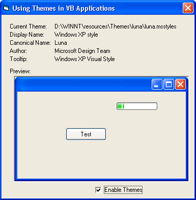



## XpThemes Type Library

### Description

This type library contains all the functions, types and constants of the new Windows XP Theme API.

It also comes with a sample project that explains how to create your own Theme aware controls.
 
### More Info
 
The included sample project requires WindowsXP to run.

             |
---                |---
**Submitted On**   |2001-09-29 20:12:06
**By**             |[Pieter Philippaerts](https://github.com/Planet-Source-Code/PSCIndex/blob/master/ByAuthor/pieter-philippaerts.md)
**Level**          |Intermediate
**User Rating**    |4.3 (26 globes from 6 users)
**Compatibility**  |VB 4\.0 \(32\-bit\), VB 5\.0, VB 6\.0
**Category**       |[Windows API Call/ Explanation](https://github.com/Planet-Source-Code/PSCIndex/blob/master/ByCategory/windows-api-call-explanation__1-39.md)
**World**          |[Visual Basic](https://github.com/Planet-Source-Code/PSCIndex/blob/master/ByWorld/visual-basic.md)
**Archive File**   |[XpThemes T271749292001\.zip](https://github.com/Planet-Source-Code/pieter-philippaerts-xpthemes-type-library__1-27647/archive/master.zip)

